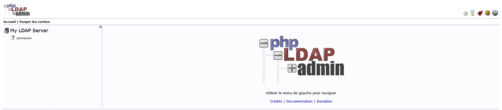

# 

# Annuaire d'entreprise

## Serveurs d'annuaires LDAP

| Nom                     | Description                                                                                          | Lien                                                                                             |
|-------------------------|------------------------------------------------------------------------------------------------------|--------------------------------------------------------------------------------------------------|
| ❤️ OpenLDAP              | Serveur d'annuaire LDAP open source, largement utilisé pour la gestion des identités et des accès en entreprise. | [OpenLDAP](https://www.openldap.org/)                                                            |
| 389 Directory Server     | Serveur d'annuaire LDAP open source, stable et performant, conçu pour les grandes entreprises.        | [389 Directory Server](https://directory.fedoraproject.org/)                                      |
| Apache Directory Server  | Serveur d'annuaire LDAP open source, avec une interface utilisateur graphique pour gérer les données LDAP. | [Apache Directory Server](https://directory.apache.org/)                                          |
| FreeIPA                  | Système de gestion d'identités et d'annuaire LDAP complet, intégrant également la gestion des politiques de sécurité. | [FreeIPA](https://www.freeipa.org/)                                                               |

## Plateformes de gestion d'identités (IAM)

| Nom           | Description                                                                                         | Lien                                                                                           |
|---------------|-----------------------------------------------------------------------------------------------------|------------------------------------------------------------------------------------------------|
| ❤️ Keycloak   | Plateforme open source de gestion des identités et des accès, avec des fonctionnalités d'authentification unique (SSO) et de fédération d'identités. | [Keycloak](https://www.keycloak.org/)                                                          |
| Gluu          | Suite de gestion d'identités open source pour l'authentification, l'autorisation et la fédération des identités. | [Gluu](https://www.gluu.org/)                                                                  |
| ❤️ FreeIPA    | Système de gestion des identités basé sur LDAP, Kerberos et d'autres technologies pour une solution IAM complète. | [FreeIPA](https://www.freeipa.org/)                                                             |
| FusionAuth    | Solution open source de gestion des identités, facile à intégrer avec des applications web et mobiles. | [FusionAuth](https://fusionauth.io/)                                                            |

## Annuaire d'entreprise et gestion des contacts

| Nom               | Description                                                                                     | Lien                                                                                           |
|-------------------|-------------------------------------------------------------------------------------------------|------------------------------------------------------------------------------------------------|
| EGroupware        | Suite open source de collaboration, intégrant un annuaire d'entreprise pour la gestion des contacts et des utilisateurs. | [EGroupware](https://www.egroupware.org/)                                                      |
| SOGo              | Serveur open source collaboratif avec des fonctionnalités d'annuaire d'entreprise, compatible avec des clients Outlook et Thunderbird. | [SOGo](https://sogo.nu/)                                                                       |
| ❤️ Zimbra         | Suite de messagerie et collaboration open source, incluant un annuaire d'entreprise et la gestion des contacts. | [Zimbra](https://www.zimbra.com/)                                                              |
| ❤️ Nextcloud Contacts | Application de gestion des contacts intégrée à la suite Nextcloud, offrant des fonctionnalités d'annuaire d'entreprise. | [Nextcloud Contacts](https://nextcloud.com/)                                                    |

## Solutions d'annuaire d'entreprise avec intégration LDAP

| Nom                    | Description                                                                                       | Lien                                                                                           |
|------------------------|---------------------------------------------------------------------------------------------------|------------------------------------------------------------------------------------------------|
| FusionDirectory         | Interface de gestion pour OpenLDAP, facilitant la gestion des utilisateurs, des groupes et des ressources dans l'annuaire. | [FusionDirectory](https://www.fusiondirectory.org/)                                             |
| LDAP Account Manager    | Interface web open source pour gérer les utilisateurs et les groupes dans un annuaire LDAP.        | [LDAP Account Manager](https://www.ldap-account-manager.org/lamcms/)                            |
| GOsa²                   | Outil open source pour la gestion centralisée des systèmes via LDAP, avec une interface utilisateur conviviale. | [GOsa²](https://gosa-project.org/)                                                              |
| ❤️ phpLDAPadmin         | Interface web open source pour l'administration des serveurs LDAP.                                 | [phpLDAPadmin](https://phpldapadmin.sourceforge.io/wiki/index.php/Main_Page)                    |

## Outils de synchronisation des annuaires

| Nom                             | Description                                                                                       | Lien                                                                                           |
|----------------------------------|---------------------------------------------------------------------------------------------------|------------------------------------------------------------------------------------------------|
| Lsc (LDAP Synchronization Connector) | Outil open source de synchronisation d'annuaires LDAP, avec support pour plusieurs sources de données. | [Lsc](https://lsc-project.org/)                                                                |
| Univention Corporate Server (UCS)| Distribution Linux open source pour la gestion des identités et des accès, avec intégration et synchronisation LDAP. | [UCS](https://www.univention.com/products/ucs/)                                                 |
| Syncope                          | Plateforme open source de gestion des identités et des accès (IAM), avec des fonctionnalités avancées de synchronisation des utilisateurs entre annuaires. | [Syncope](https://syncope.apache.org/)                                                          |

## Annuaire d'entreprise pour la gestion des ressources

| Nom           | Description                                                                                          | Lien                                                                                           |
|---------------|------------------------------------------------------------------------------------------------------|------------------------------------------------------------------------------------------------|
| iTop          | Outil open source de gestion de la configuration (CMDB) et des ressources, avec des fonctionnalités d'annuaire d'entreprise. | [iTop](https://www.itophub.io/)                                                                |
| ❤️ GLPI       | Système open source de gestion des ressources et des services IT, avec des fonctionnalités d'annuaire et d'inventaire. | [GLPI](https://glpi-project.org/)                                                              |
| NetBox        | Outil open source de gestion d'infrastructure réseau et de documentation des ressources, incluant la gestion des utilisateurs et des accès. | [NetBox](https://netbox.readthedocs.io/en/stable/)                                              |
| RackTables    | Outil open source de gestion des centres de données et de documentation des ressources, avec des fonctionnalités d'annuaire pour la gestion des utilisateurs. | [RackTables](https://www.racktables.org/)                                                       |
