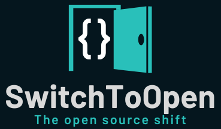
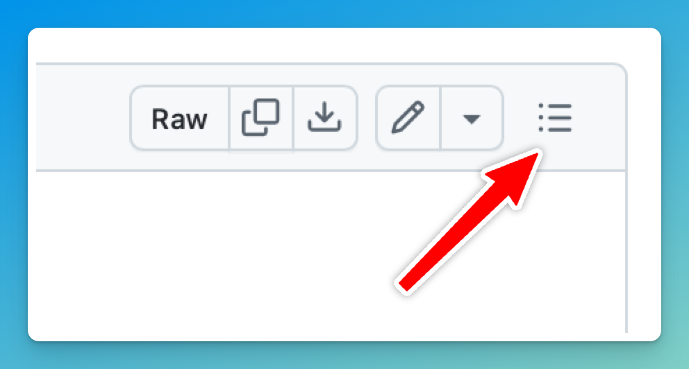

# Welcome to the SwitchToOpen - Your Open soure shift

##
**Le but de ce dépôt est de créer une ressource collaborative et exhaustive d’outils open source permettant aux utilisateurs, aux professionnels et aux entreprises de trouver des alternatives aux logiciels propriétaires dans divers domaines, tels que la sécurité, la gestion de réseaux, la bureautique, le développement, etc.**

Objectifs principaux :
- **Promouvoir les solutions open source** : Sensibiliser et encourager l’utilisation d’outils open source qui offrent une indépendance vis-à-vis des grands éditeurs de logiciels propriétaires.
- **Réduire les coûts** : Proposer des alternatives gratuites pour remplacer des outils coûteux tout en maintenant une qualité professionnelle.
- **Accroître la transparence** : Les solutions open source permettent une transparence et une sécurité accrues, car le code est ouvert et vérifiable.

Fonctionnalités du dépôt :
- Organisation par catégories d’outils (antivirus, gestion d’annuaire, développement, etc.) pour faciliter la recherche.
- Informations sur chaque outil, incluant une description, un lien, et parfois des caractéristiques spécifiques.
- Collaboratif : La communauté peut contribuer à ajouter de nouveaux outils, mettre à jour les descriptions, et enrichir la liste.

Ce dépôt a vocation à devenir un référentiel central pour tous ceux qui souhaitent adopter un environnement numérique libre et bénéficier des avantages des logiciels open source.

##

Pour naviguer chacune des pages plus confortablement, cliquer l'icône outline pour afficher la table des matières :

## Inventaire
- [**Annuaire d'entreprise**](/Annuaire%20d'entreprise.md)
- [**Antivirus**](/Antivirus.md)
- [**Design graphique et multimédia**](/Design%20graphique%20et%20multim%C3%A9dia.md)
- [**Développement et d'intégration continue**](/D%C3%A9veloppement%20et%20d'int%C3%A9gration%20continue.md)
- [**Gestion de base de données**](/Gestion%20de%20base%20de%20donn%C3%A9es.md)
- [**Gestion de logiciels de signatures électroniques**](/Gestion%20de%20signatures%20%C3%A9lectroniques.md)
- [**Gestion de projet**](/Gestion%20de%20projet.md)
- [**Gestion des acces distants**](/Gestion%20des%20acces%20distants.md)
- [**Gestion des logs**](/Gestion%20des%20logs.md)
- [**Gestion des mots de passe**](/Gestion%20des%20mots%20de%20passe%20et%20secrets.md)
- [**Gestion des risques et conformité**](/Gestion%20des%20risques%20et%20conformit%C3%A9.md)
- [**Messagerie et collaboration d'équipe**](/Messagerie%20et%20collaboration%20d'%C3%A9quipe.md)
- [**Moteurs de recherche**](/Moteurs%20de%20recherche.md)
- [**Outils ERP et CRM**](/Outils%20ERP%20et%20CRM.md)
- [**Outils SIEM**](/Outils%20SIEM.md)
- [**Outils d'analytique et de business intelligence (BI)**](/Outils%20d'analytique%20et%20de%20business%20intelligence%20(BI).md)
- [**Outils CTI et de prévention des menaces cyber**](/Outils%20CTI%20et%20de%20prévention%20des%20menaces%20cyber.md)
- [**Outils de communication et de visioconférence**](/Outils%20de%20communication%20et%20de%20visioconf%C3%A9rence.md)
- [**Outils de reporting**](/Outils%20de%20reporting.md)
- [**Sauvegarde et récupération de données**](/Sauvegarde%20et%20r%C3%A9cup%C3%A9ration%20de%20donn%C3%A9es.md)
- [**Sécurité**](/S%C3%A9curit%C3%A9.md)
- [**Serveurs web**](/Serveurs%20web.md)
- [**Stockage et gestion de fichiers**](/Stockage%20et%20gestion%20de%20fichiers.md)
- [**Suites bureautiques**](/Suites%20bureautiques.md)
- [**Supervision**](/Supervision.md)
- [**Systèmes d'exploitation**](/Syst%C3%A8mes%20d'exploitation.md)
- [**Systèmes de gestion de contenu (CMS)**](/Syst%C3%A8mes%20de%20gestion%20de%20contenu.md)
- [**Virtualisation**](/Virtualisation.md)
- [**Web Application Firewall (WAF)**](/Web%20Application%20Firewall.md)

## Déclaration d'impartialité

Cette liste a été créée de manière totalement impartiale.
Nous tenons à préciser que nous n'avons aucun lien d'affiliation avec les éditeurs ou les créateurs des outils mentionnés. Notre objectif est simplement de fournir une ressource exhaustive et utile pour les professionnels et les passionnés de la sécurité informatique qui souhaitent explorer les alternatives open source disponibles. Chaque outil a été sélectionné en fonction de ses fonctionnalités et de sa pertinence dans le domaine, sans influence commerciale ou parti pris.

## [**Contribution**](CONTRIBUTING.md)

- Rejoignez la communauté sur notre serveur Discord pour discuter des alternatives open-source et des contributions au projet : [Lien vers le serveur Discord](https://discord.gg/XqgdnZFQzF)

